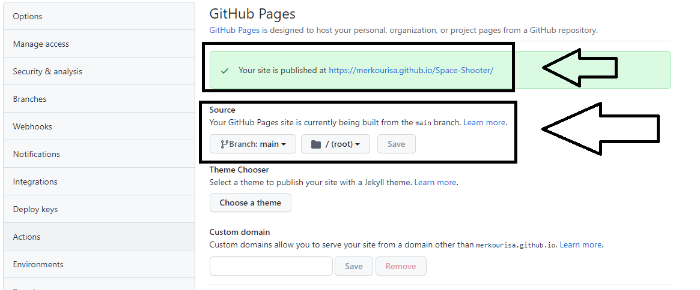
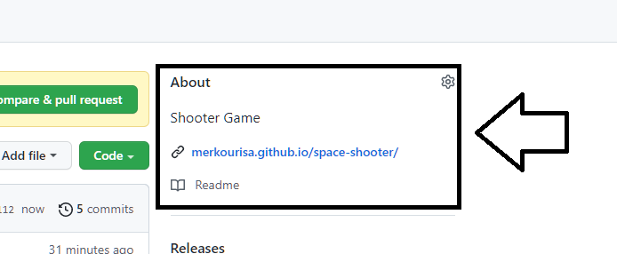

# Δημιουργία Space Shooter

Σκοπός της εργασίας είναι να επεκτείνεις το Space Shooter --ένα Web video game--. Για τον σκοπό αυτό θα χρησιμοποιήσουμε τo [Unity](https://unity.com/). Για την εργασία θα στηριχθείς σε ένα υπάρχον παιχνίδι το Space Shooter και στη συνέχεια θα πρέπει να το επεκτείνεις. Για την ανάπτυξη του παιχνίδιου μπορείς να χρησιμοποιήσεις το Unity. Αρχικά θα πρέπει να δημιουργήσεις ένα αντίγραφο (fork) του [αποθετηρίου](https://github.com/merkourisa/Space-Shooter) του παιχνιδίου και στη συνέχεια να υλοποιήσεις τα ζητούμενα όπως περιγράφονται στα ανοιχτά [issues](https://github.com/merkourisa/Space-Shooter/issues) της εργασίας.

## Initial Settings
- Από την στιγμή που έχεις κάνει αντιγραφή (fork) το [αποθετήριο](https://github.com/ioniodi/Shooter) του παιχνιδιού, θα πρέπει να έχει κατέβει στο προσωπικό σου github αποθετήριο ο [κώδικας του παιχνιδιού](https://github.com/merkourisa/Space-Shooter/tree/sources) και το εκτελέσιμο του παιχνιδιού [Build](https://github.com/merkourisa/Space-Shooter/tree/main).

- Ενεργοποίησε το Github Pages στα setting του προσωπικού σου repository  και *άλλαξε το λινκ στην κορυφή του αποθετηρίου σου ώστε να δείχνει στην σελίδα του παιχνιδιού σου.*

**Προσοχή:** Για να βαθμολογηθεί το παιχνίδι πρέπει να βρίσκεται υποχρεωτικά στην προσωπική σας github page.

## Βαθμολόγηση
Λαμβάνοντας υπόψη το ποσοστό της εργασίας στον τελικό βαθμό, με άριστα το 6 τα παραδοτέα βαθμολογούνται ως εξής:
- Αλλαγές στο παιχνίδι όπως περιγράφονται στο [παραδοτέο 1](https://github.com/merkourisa/Space-Shooter/issues/1): μέχρι +2 μονάδες. 
- Αλλαγές στο παιχνίδι όπως περιγράφονται στο [παραδοτέο 2](https://github.com/merkourisa/Space-Shooter/issues/2): μέχρι +2 μονάδες.
- Αλλαγές στο παιχνίδι όπως περιγράφονται στο [παραδοτέο 3](https://github.com/merkourisa/Space-Shooter/issues/3): μέχρι +2 μονάδες.
- Bonus: Αλλαγές στο παιχνίδι όπως περιγράφονται στο [παραδοτέο 4](https://github.com/merkourisa/Space-Shooter/issues/4):μέχρι +2 μονάδες.

## Resources
https://learn.unity.com/tutorial/introduction-to-space-shooter?uv=5.x&projectId=5c5148e1edbc2a001fd5bdfe
